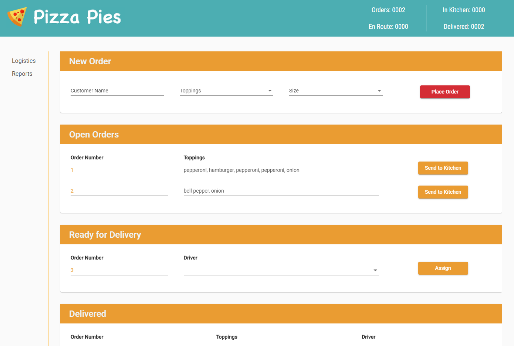
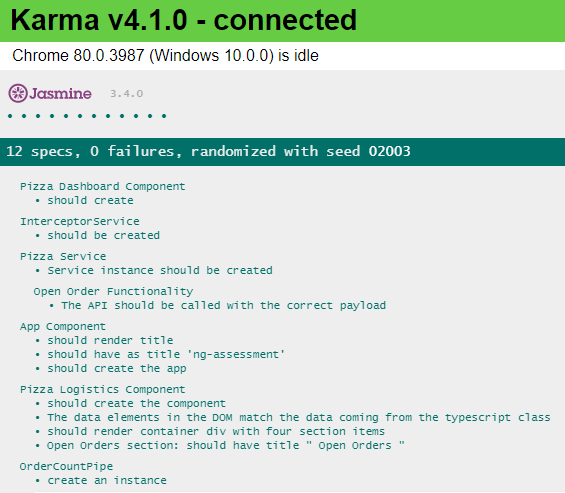

# NgAssessment

This project is designed to assess the technical ability of a developer in regards to their Angular skill set.

Set aside a dedicated amount time that you can focus on this project. This should be done in one continuous sitting and may take up to four hours.

This goal of this assessment is to find out how you approach solving problems from an Angular perspective.

## Standards
Follow the Angular standards set forth the in the [Angular Style Guide](https://angular.io/guide/styleguide)

Additional standards that are advisable to follow:
+ All variables must be typed.
+ Do not type variables with `any`.
+ Include access modifiers for **ALL** member variables (does not include `@Input, @Output, @ViewChild, etc.)

+ Include an access modifier and return type for **ALL** functions.

+ Suffix stream objects with `$`
	+ e.g. `const data$: Observable<data>`

## Creating the initial timestamp
In order to better gauge the amount of time the solution takes, please create an initial commit to your fork when starting the solution.
This helps us better understand your strengths and weaknesses. If you make more frequent commits, then it also gives an idea of how much time is spent on each piece of the solution

## Submitting your solution
The process to submit the solution should be from a pull request from a fork.

+ Create a fork on Bitbucket.
+ Clone the forked repository your local system.
+ Modify the local repository.
+ Run TsLint on your code using the command `npm run build:solution`
+ Commit your changes.
+ Push changes back to the remote fork on Bitbucket.
+ Create a pull request from the forked repository (source) back to the original (destination).

## Running the dev environment

The project is configured to use a mock API server. Data is not configured to persist and will be reset 
when `json-server`is restarted.

Use the following command to start the application with the mock server running in the background.

`npm run start:dev:mock`

## Goals
These goals are listed in priority order.
+ Create the the different cards for each section of the Logistics page
    + Use `mat-card` for the item
+ Implement the *New Order* section
    + The order must call the API to persist the data. Data should be available when the application is restarted
    + Customer name should accept alpha-numeric input only.
    + Toppings is a multi-select control.
    + Size is a single select control.
    + Upon placing the order, it should appear in the *Open Orders* in real-time.
    + Change the status of the order to `New`.
+ Implement *Open Orders* section
    + Display the open order information.
    + Use the `mdTruncate` directive for when the toppings overflow the label
    + Send to kitchen simulates the cooking of a pizza.
        + Pizzas take at least 5s to cook for no toppings
        + Calculate the rest of the time based on the time variable for the toppings. E.g. pepperoni adds an extra 2s to the cooking time.
        + Change the status of the order to `ReadyForDelivery`.
        + Persist the information to the API.
+Implement *Ready for Delivery* section
    + Each pizza takes 15s to be delivered.
    + Pizzas may be queued for the same driver.
    + Pizzas are delivered one at a time.
    + Changed the status of the order to `Delivered` once the delivery is complete.
    + Persist the information to the API.
    
## Stretch Goals

+ Complete the following Unit Tests. The following unit tests would be sufficient to show the understanding of the conept.
    + Open Orders functionality
        + The data elements in the DOM match the data coming from the typescript class
        + The API is called with the correct payload.
        
+ Styling
    + Update the default Angular Material theme to do change the colors to match the mockup.
    
## Mockup

## UML

## Screenshots

## Salient Features
* Added Interceptor and Http Loader to show spinner for every http calls
* Added Pipe to filter order counts in 'XXXX' format
